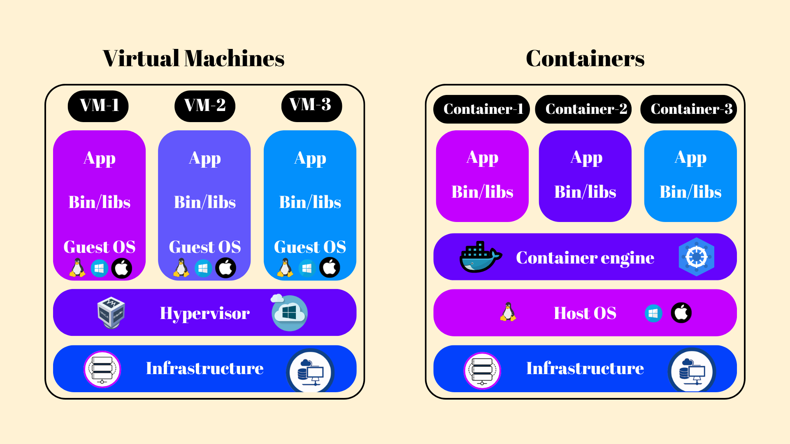
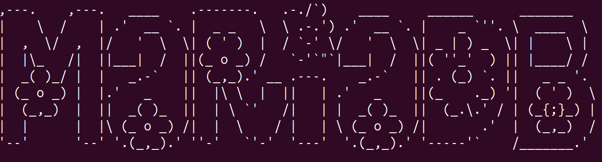

<!--=====================================
=           INTRODUCTION              =
======================================-->
# Introduction to Inception 🚀

A comprehensive guide to building a containerized web infrastructure.

<!--=====================================
=         TABLE OF CONTENTS           =
======================================-->
# Table of Contents 📚

1. [Introduction to Inception](#introduction-to-inception)
   - [What is Inception?](#what-is-inception)
   - [Project Goals](#project-goals-)
   - [Architecture Overview](#architecture-overview-️)
     - [Mandatory Services](#1-mandatory-services)
     - [Bonus Services](#2-bonus-services)
     - [Additional Services](#3-additional-services)
   - [Key Technical Requirements](#key-technical-requirements-)
     - [Base Image Choice](#1-base-image-choice)
     - [Container Organization](#2-container-organization)
     - [Data Management](#3-data-management)
     - [Networking](#4-networking)
     - [Configuration](#5-configuration)
   - [Project Structure](#project-structure-)

2. [Docker Fundamentals](#docker-fundamentals-)
   - [What is Docker?](#what-is-docker)
   - [Why Docker?](#why-docker-)
   - [Key Docker Components](#key-docker-components-)
   - [Docker in Inception Project](#docker-in-inception-project-)
     - [Traditional Docker vs. Inception Approach](#traditional-docker-vs-inception-approach)
     - [Why Build From Scratch?](#why-build-from-scratch)
     - [Project Implementation](#project-implementation)
   - [Process Management](#docker-process-management-and-pid-1-)
     - [Understanding PID 1](#understanding-pid-1-in-docker-)
     - [Why PID 1 Matters](#why-pid-1-matters-)
     - [Implementation Best Practices](#our-implementation-best-practices-)
     - [Testing Implementation](#testing-our-implementation-)
   - [ENTRYPOINT vs CMD](#entrypoint-vs-cmd-deep-dive-)
     - [Understanding Differences](#understanding-the-differences)
     - [Common Patterns](#common-patterns)
     - [Project Examples](#inception-project-examples)
     - [Best Practices](#best-practices-summary-)

3. [All Alpine](#all-alpine-️)
   - [The Alpine Choice](#the-alpine-choice)
   - [Why Alpine?](#why-alpine)
     - [Size Matters](#size-matters-)
     - [Security First](#security-first-️)
     - [Package Management](#package-management-)
   - [Implementation in Inception](#implementation-in-inception)
   - [Impact on Services](#impact-on-services)
   - [Trade-offs and Considerations](#trade-offs-and-considerations)

4. [Core Services](#core-services)
   - [NGINX](#core-services-nginx-)
     - [What is NGINX?](#what-is-nginx-)
     - [Why NGINX?](#why-nginx-)
     - [Security Benefits](#security-benefits-️)
     - [Performance Advantages](#performance-advantages-)
     - [Service Integration Benefits](#service-integration-benefits-)
     - [Technical Implementation](#technical-implementation-)
   - [WordPress](#core-services-wordpress-)
     - [What is WordPress?](#what-is-wordpress-)
     - [Why WordPress + PHP-FPM?](#why-wordpress--php-fpm-)
     - [Architecture Benefits](#architecture-benefits-️)
     - [Technical Implementation](#technical-implementation--1)
     - [WordPress Initialization](#wordpress-initialization-)
     - [Security Implementation](#security-implementation-)
     - [Performance Optimization](#performance-optimization-)
   - [MariaDB](#core-services-mariadb-️)
     - [What is MariaDB?](#what-is-mariadb-)
     - [Why MariaDB?](#why-mariadb-)
     - [Architecture Benefits](#architecture-benefits-️-1)
     - [Technical Implementation](#technical-implementation--2)
     - [MariaDB Configuration](#mariadb-configuration)
     - [Database Initialization](#database-initialization)
     - [Security Implementation](#security-implementation--1)
     - [Performance Optimization](#performance-optimization--1)

5. [Bonus Services](#bonus-services)
   - [Adminer](#bonus-services-adminer-️)
     - [What is Adminer?](#what-is-adminer-)
     - [Why Adminer?](#why-adminer-)
     - [Architecture Benefits](#architecture-benefits-️-2)
     - [Technical Implementation](#technical-implementation--3)
     - [Security Implementation](#security-implementation--2)
     - [Performance Optimization](#performance-optimization--2)
   - [Redis](#bonus-services-redis-)
     - [What is Redis?](#what-is-redis-)
     - [Why Redis?](#why-redis-)
     - [Technical Implementation](#technical-implementation--4)
     - [WordPress Integration](#wordpress-integration-1)
     - [Security and Performance](#security-and-performance-️)
   - [FTP/FTPS](#bonus-services-ftpftps-)
     - [What is VSFTPD?](#what-is-vsftpd-)
     - [Why VSFTPD?](#why-vsftpd-)
     - [Technical Implementation](#technical-implementation--5)
     - [VSFTPD Configuration](#vsftpd-configuration)
     - [SSL Certificate Management](#ssl-certificate-management)
     - [Security and Performance](#security-and-performance--1)
   - [Gatsby App](#bonus-services-gatsby-app-)
     - [What is Gatsby?](#what-is-gatsby-)
     - [Why Gatsby?](#why-gatsby-)
     - [Implementation](#implementation-)
   - [Alien Eggs Game](#bonus-services-alien-eggs-game-)
     - [What is Alien Eggs?](#what-is-alien-eggs-)
     - [Implementation Features](#implementation-features-)
     - [Technical Setup](#technical-setup-)
     - [Monitoring Features](#monitoring-features-)

6. [Additional Services](#additional-services)
   - [cAdvisor](#monitoring-services-cadvisor-)
     - [What is cAdvisor?](#what-is-cadvisor-)
     - [Why cAdvisor?](#why-cadvisor-)
     - [Implementation](#implementation--1)
     - [Metrics Collection](#metrics-collection-)
   - [Prometheus](#monitoring-services-prometheus-)
     - [What is Prometheus?](#what-is-prometheus-)
     - [Why Prometheus?](#why-prometheus-)
     - [Implementation](#implementation--2)
     - [Service Setup](#service-setup-️)
     - [Monitoring Integration](#monitoring-integration-)
   - [Grafana](#monitoring-services-grafana-)
     - [What is Grafana?](#what-is-grafana-)
     - [Why Grafana?](#why-grafana-)
     - [Implementation](#implementation--3)
     - [Security and Maintenance](#security-and-maintenance-️)

7. [Conclusion](#Conclusion-)
   - [Project Overview](#project-overview)
   - [Key Takeaways](#key-takeaways)
   - [Moving Forward](#moving-forward)

8. [A Word from the container abyss](#a-word-from-the-abyss-)

---

<!--=====================================
=         PROJECT OVERVIEW            =
======================================-->
## What is Inception?

Inception is an advanced system administration project that challenges you to build and orchestrate a complete infrastructure using Docker containerization. The project simulates a real-world production environment where multiple services work together to deliver a robust web application stack.

<!--=====================================
=         PROJECT GOALS               =
======================================-->
## Project Goals 🎯

The main objectives of Inception are:

1. **Containerization Mastery**: Learn to build and manage Docker containers from scratch, without using pre-built images
2. **Service Orchestration**: Create a multi-service infrastructure where each component runs in its own container
3. **Infrastructure as Code**: Implement all configurations through scripts, ensuring reproducibility and maintainability
4. **Security Implementation**: Set up secure communication between services and implement proper access controls

<!--=====================================
=       ARCHITECTURE OVERVIEW         =
======================================-->
## Architecture Overview 🏗️

The Inception infrastructure consists of:

### 1. Mandatory Services
- 🌐 **NGINX**: Acts as a reverse proxy with SSL/TLS termination  
- 🖥️ **WordPress + PHP-FPM**: Main application server  
- 🗄️ **MariaDB**: Database server for persistent data storage  

### 2. Bonus Services
- ⚡ **Redis**: Caching system for WordPress optimization  
- 📂 **VSFTPD**: FTP server for file management  
- 📊 **Adminer**: Database management interface  
- 🚀 **Gatsby**: Static site generator for additional content  
- 🎮 **Custom Game Integration**: Demonstrating versatile deployment capabilities  

### 3. Additional Services
- 📈 **Prometheus**: Metrics collection and storage  
- 📉 **Grafana**: Visualization and dashboard creation  
- 🛠️ **cAdvisor**: Container metrics collection


*Note: The monitoring services are neither part of the mandatory requirements nor the bonus part. They were added as a learning exercise to explore container monitoring.*

<!--=====================================
=     TECHNICAL REQUIREMENTS          =
======================================-->
## Key Technical Requirements 📋

1. **Base Image Choice**
   - Containers must use either Alpine Linux or Debian as their base image
   - In this implementation, we chose Alpine Linux (rationale detailed in later sections)
   - Custom Dockerfiles must be written for each service
   - No use of pre-built Docker images from Docker Hub

2. **Container Organization**
   - Each service runs in its dedicated container
   - Services must automatically restart on failure
   - Proper resource isolation between containers

3. **Data Management**
   - Persistent data storage through Docker volumes
   - Efficient backup and restore capabilities
   - Data integrity across container restarts

4. **Networking**
   - Isolated Docker networks for different service groups
   - Secure internal communication
   - External access only through designated ports

5. **Configuration**
   - All setup performed through initialization scripts
   - Environment variable management
   - No manual intervention in container configuration

<!--=====================================
=         PROJECT STRUCTURE           =
======================================-->
## Project Structure 📁

The project follows a clear organizational structure:

```
inception/
├── srcs/
│   ├── docker-compose.yml
│   └── requirements/
│       ├── nginx/
│       ├── wordpress/
│       ├── mariadb/
│       └── bonus/
│           ├── redis/
│           ├── ftp/
│           ├── adminer/
│           ├── gatsby-app/
│           └── monitoring/  # Additional services
└── Makefile
```

This structure ensures:
- Clear separation of services
- Easy maintenance and updates
- Scalable architecture
- Efficient development workflow

The Inception project represents a comprehensive approach to modern infrastructure deployment, combining security, efficiency, and maintainability in a containerized environment. 🌟

---

<!--=====================================
=         DOCKER FUNDAMENTALS         =
======================================-->
# Docker Fundamentals 🐳

## What is Docker?

Docker is a platform for developing, shipping, and running applications in isolated environments called containers. A container is a lightweight, standalone package that includes everything needed to run a piece of software - from the code and runtime to system libraries and settings.



<!--=====================================
=         DOCKER BENEFITS             =
======================================-->
## Why Docker? 🤔

Docker solves several key challenges in modern software development:

1. **Consistency**: "It works on my machine" becomes a problem of the past
2. **Isolation**: Applications run independently without interfering with each other
3. **Efficiency**: Containers share the host OS kernel, making them lighter than VMs
4. **Scalability**: Easy to deploy multiple instances of the same application

## Key Docker Components 🔧

- **Dockerfile**: A text file containing instructions to build an image
- **Image**: A template for creating containers (like a snapshot)
- **Container**: A running instance of an image
- **Docker Compose**: Tool for defining and running multi-container applications

<!--=====================================
=         DOCKER IN INCEPTION         =
======================================-->
## Docker in Inception Project 🎯

### Traditional Docker vs. Inception Approach

**Traditional Approach:**
```bash
# Pulling pre-built images
docker pull wordpress:latest
docker pull mysql:latest
```

**Inception Approach:**
```dockerfile
# Building custom WordPress image
FROM alpine:3.20
RUN apk add --no-cache php php-fpm wordpress
# Custom configurations...
```

<!-- <ADD IMAGE: "Visual comparison between Traditional Docker Approach (pulling images) vs Inception Approach (building from scratch), showing the layers and components involved in each approach">

 circa 700mb wordpress:lates, circa 140mb wordpress custom--> 

### Why Build From Scratch?

1. **Understanding**: Gain deep knowledge of service configuration
2. **Control**: Full control over what goes into each container
3. **Security**: Minimize vulnerabilities by including only necessary components
4. **Optimization**: Create lean containers tailored to specific needs

### Project Implementation

In Inception, we:
- Write custom Dockerfiles for each service
- Configure services through initialization scripts
- Use docker-compose for orchestration
- Implement proper networking and volume management

This approach provides valuable learning opportunities and better control over the infrastructure, though in production environments, validated official images might be preferred for their reliability and maintenance.

<!--=====================================
=         PROCESS MANAGEMENT          =
======================================-->
## Docker Process Management and PID 1 🔄

## Understanding PID 1 in Docker 🎯

In Docker containers, the first process that starts (PID 1) plays a crucial role in process management and container lifecycle. Unlike traditional Linux systems where systemd or init handles process management, in containers, your application or a designated init process must handle these responsibilities.

### Why PID 1 Matters 🤔

1. **Signal Handling**
   - PID 1 must properly handle process signals (SIGTERM, SIGINT, etc.)
   - Responsible for forwarding signals to child processes
   - Critical for graceful container shutdown

2. **Zombie Process Prevention**
   - Must reap zombie (defunct) processes
   - Prevent resource leaks
   - Maintain container health

3. **Container Lifecycle**
   - Determines container state
   - Manages application startup
   - Handles cleanup on shutdown

## Our Implementation: Best Practices ✅

In our Inception project, we implement a robust solution for process management that ensures proper signal handling and clean container lifecycle management. Here's how:

### 1. ENTRYPOINT in Exec Form

We use the exec form of ENTRYPOINT in our Dockerfiles:
```dockerfile
ENTRYPOINT ["/init.sh"]
```

This is crucial because:
- Runs the init script directly, not through a shell
- Makes our init script PID 1 initially
- Ensures proper signal propagation
- Prevents additional shell processes

### 2. Init Scripts with exec

Our init scripts end with the `exec` command:
```bash
#!/bin/sh
set -e

# Configuration and setup...

# Replace shell with the main process
exec nginx -g "daemon off;"
```

This approach is ideal because:
- The `exec` command replaces the shell process with the service process
- The service becomes PID 1 directly
- No shell remains in between Docker and the service
- Professional services (NGINX, PHP-FPM, MariaDB) handle signals properly

### Why Our Approach Works Well 🎯

1. **No Shell Interference**
   - Using exec form of ENTRYPOINT avoids shell wrapping
   - `exec` in scripts ensures direct process execution
   - No intermediate shell processes remain

2. **Professional Service Integration**
   - Services like NGINX, MariaDB, and PHP-FPM have built-in signal handling
   - They manage their own child processes
   - They handle graceful shutdowns properly

3. **Clean Process Tree**
   ```
   PID 1 (Service Process)
   └── Child processes (if any)
   ```
   No unnecessary layers or shell processes

4. **Direct Signal Propagation**
   ```
   Docker -> Service Process (PID 1)
              └── Clean shutdown handling
   ```
   No signal forwarding needed

### Examples from Our Services

1. **NGINX**
```bash
exec nginx -g "daemon off;"
```
NGINX receives signals directly and handles graceful shutdown of worker processes.

2. **PHP-FPM**
```bash
exec php-fpm82 -F
```
PHP-FPM manages its worker pool and handles signals for graceful worker shutdown.

3. **MariaDB**
```bash
exec mysqld --datadir="$MARIADB_DATA_DIR" --user=mysql
```
MariaDB handles database connections and ensures proper cleanup on shutdown.

### Why We Don't Need Additional Signal Handling

Despite what some examples show, we don't need explicit signal handling in our init scripts because:

1. We use the exec form of ENTRYPOINT: `ENTRYPOINT ["/init.sh"]`
2. Our init scripts use `exec` to replace themselves with the service

The key is that there's never a shell sitting between Docker and our service processes. When Docker sends a signal, it goes directly to the service process, which knows how to handle it properly.

## Testing Our Implementation ✅

You can verify our implementation works correctly by:

```bash
# Graceful shutdown test
docker-compose stop

# Check logs for clean shutdown
docker-compose logs nginx

# Verify no zombie processes
docker top nginx
```

This setup provides clean process management and proper signal handling while maintaining simplicity and reliability. 🚀

## ENTRYPOINT vs CMD Deep Dive 🔍

### Understanding the Differences

1. **ENTRYPOINT**
   - Defines the executable to run
   - Hard to override (requires --entrypoint flag)
   - Receives CMD as arguments
   - Better for "executable" containers

2. **CMD**
   - Provides default arguments
   - Easily overridden at runtime
   - Can be completely replaced
   - Flexible for general use

### Common Patterns

1. **Executable with Default Arguments**
```dockerfile
ENTRYPOINT ["nginx"]
CMD ["-g", "daemon off;"]
```
- ENTRYPOINT defines the executable
- CMD provides default arguments
- Can override arguments but not executable

2. **Single Command with Init**
```dockerfile
ENTRYPOINT ["/init.sh"]
```
- Script handles all setup and execution
- No default arguments needed
- Clear entry point for container

3. **Flexible Command**
```dockerfile
CMD ["php-fpm"]
```
- Can be completely overridden
- Suitable for development containers
- Maximum flexibility

### Inception Project Examples

1. **NGINX Container**
```dockerfile
COPY --chown=nginx:nginx ./tools/init.sh /init.sh
RUN chmod +x /init.sh
ENTRYPOINT ["/init.sh"]
```
- Uses init script for setup
- Handles SSL configuration
- Manages process lifecycle

2. **Alien-Eggs Container**
```dockerfile
ENTRYPOINT [ "python3", "/app/src/serve.py" ]
CMD ["--root", "/app/src", "--no-browser", "--port", "8060", "--metrics-port", "8000"]
```
- Direct process execution
- Configuration via arguments
- No complex initialization needed

## Best Practices Summary 📋

1. **Process Management**
   - Use init scripts for complex services
   - Implement proper signal handling
   - Manage child processes effectively
   - Handle cleanup on shutdown

2. **ENTRYPOINT Usage**
   - Use for primary executable
   - Initialize environment if needed
   - Handle signals properly
   - Set up logging

3. **CMD Considerations**
   - Provide default arguments
   - Allow runtime flexibility
   - Consider development needs
   - Enable easy overrides

4. **General Guidelines**
   - One main process per container
   - Proper signal handling
   - Clear process ownership
   - Efficient cleanup procedures

Following these practices ensures robust container operation, proper process management, and reliable service execution in our infrastructure. 🚀

---

<!--=====================================
=         ALPINE LINUX                =
======================================-->
# All Alpine 🏔️

## The Alpine Choice

In Inception, we had the choice between Debian and Alpine Linux as base images for our containers. We chose Alpine Linux for all our services, a decision that brings specific advantages to our containerized infrastructure.

<!--=====================================
=         ALPINE BENEFITS             =
======================================-->
## Why Alpine? 

### Size Matters 📦
- **Minimal Base Image**: Alpine base image is ~5MB compared to Debian's ~114MB
- **Smaller Final Images**: Services built on Alpine typically result in 30-70% smaller images
- **Faster Deployments**: Smaller images mean quicker pulls and deployments

### Security First 🛡️
- **Minimal Attack Surface**: Fewer installed packages means fewer potential vulnerabilities
- **Security-oriented**: Built with security in mind from the ground up
- **Regular Security Updates**: Active maintenance and quick security patches

### Package Management 🔧
- **Simple Package Manager**: `apk` is fast, simple, and efficient
- **Rich Package Repository**: Despite its size, Alpine provides most needed packages
- **Quick Updates**: Package installation and updates are notably faster than apt


<!--=====================================
=         ALPINE IMPLEMENTATION       =
======================================-->
## Implementation in Inception

### Base Image Declaration
```dockerfile
# All our Dockerfiles start with
FROM alpine:3.20
```

### Package Installation Pattern
```dockerfile
# Alpine's efficient package installation
RUN apk update && apk add --no-cache \
    package1 \
    package2 \
    package3
```

### Key Considerations

1. **Compatibility**
   - Most services work seamlessly on Alpine
   - Some packages might have slightly different names than in Debian
   - Occasional need to install additional dependencies

2. **Learning Curve**
   - Different package names from Debian/Ubuntu
   - Simpler init system
   - Streamlined configuration approaches

3. **Advantages in Our Setup**
   - Reduced resource usage across all containers
   - Faster container startup times
   - Simplified dependency management

<!--=====================================
=         SERVICE BENEFITS            =
======================================-->
## Impact on Services

Each service benefits from Alpine in specific ways:

- **NGINX**: Lightweight reverse proxy with minimal overhead
- **WordPress**: Efficient PHP-FPM implementation
- **MariaDB**: Optimized database server with smaller footprint
- **Redis**: Fast caching with minimal resource usage
- **Monitoring Stack**: Efficient metrics collection and storage

<!--=====================================
=         CONSIDERATIONS              =
======================================-->
## Trade-offs and Considerations

While Alpine is excellent for our use case, it's important to note:

1. **Production Consideration**
   - Some teams prefer Debian for its familiarity
   - Larger community support for Debian-based solutions
   - More extensive documentation available

2. **Development Workflow**
   - Need to adapt to Alpine-specific commands
   - Different debugging tools and processes
   - Slightly different configuration paths

The choice of Alpine aligns perfectly with Inception's goals of understanding container infrastructure while maintaining efficient resource usage and security. 🎯

---

# Core Services: NGINX 🚀


<!--=====================================
=            INTRODUCTION             =
======================================-->

## What is NGINX? 🌐

NGINX (pronounced "engine-x") is a powerful, open-source software that functions as a web server, reverse proxy, load balancer, and HTTP cache. Originally designed to solve the C10K problem (handling 10,000 concurrent connections), NGINX has become one of the most popular web servers worldwide due to its efficiency and low resource consumption.


<!--=====================================
=         CORE FUNCTIONALITY          =
======================================-->

## Why NGINX? 🤔

In our Inception project, NGINX serves as the primary gateway to all our services:

1. **Single Entry Point** 🚪
   - All external traffic flows through NGINX
   - Centralized access control and monitoring
   - Simplified security management

2. **SSL/TLS Termination** 🔐
   - Handles all HTTPS encryption/decryption
   - Centralizes certificate management
   - Internal services communicate over unencrypted channels

3. **Reverse Proxy** 🔄
   - Routes requests to appropriate backend services
   - Hides internal infrastructure details
   - Provides URL path-based routing

## Security Benefits 🛡️

1. **TLS Communication**
   - Forces HTTPS for all connections
   - Implements modern TLS protocols (1.2 and 1.3)
   - Strong cipher suite configuration

2. **Network Isolation**
   - Backend services aren't directly exposed
   - Internal network segmentation
   - Minimized attack surface

## Performance Advantages ⚡

1. **Efficient Static File Serving**
   - Optimized for serving static content
   - Reduces load on application servers
   - Implements caching strategies

2. **Connection Handling**
   - Event-driven architecture
   - Excellent concurrent connection handling
   - Low memory footprint

## Service Integration Benefits 🔌

1. **WordPress Integration**
   - Serves static files directly
   - Routes PHP requests to PHP-FPM
   - Manages cache headers

2. **Monitoring Stack**
   - Routes to Prometheus/Grafana
   - URL path-based access
   - Consistent authentication

<!--=====================================
=     TECHNICAL IMPLEMENTATION        =
======================================-->

## Technical Implementation 🔧

### 1. Docker Compose Configuration

```yaml
nginx:
    container_name: nginx
    image: nginx
    build:
      context: ./requirements/nginx
      dockerfile: Dockerfile
    env_file:
      - .env
    ports:
      - "443:443"
    networks:
      - proxy
    depends_on:
      - mariadb
      - wordpress
      - ftp
      - redis
      - adminer
      - gatsby-app
      - alien-eggs
      - prometheus
      - grafana
      - cadvisor
    volumes:
      - wp-data:/var/www/html
    restart: on-failure
    healthcheck:
      test: ["CMD", "nginx", "-t"]
      interval: 30s
      timeout: 10s
      retries: 3
      start_period: 30s
```

#### Key Elements Analysis:

1. **Volume Mount (`/var/www/html`)**:
   - Essential for serving WordPress files
   - The `wp-data` volume is shared between WordPress and NGINX
   - NGINX needs direct access to these files to serve static content efficiently
   - Without this mount, NGINX couldn't serve WordPress media or static assets

2. **Port 443**:
   - Only HTTPS port is exposed
   - No HTTP (port 80) access enforces secure connections
   - Internal service communication doesn't need port exposure
   - Maps container's internal port 443 to host's port 443

3. **Network Configuration**:
   - Connected only to `proxy` network
   - Isolates NGINX from database network
   - Enables communication with backend services
   - Follows principle of least privilege

<!--=====================================
=         DOCKERFILE SETUP            =
======================================-->

### 2. Dockerfile Analysis

```dockerfile
FROM alpine:3.20

RUN apk add --no-cache \
    nginx \
    openssl \
    apache2-utils \
    curl \
    shadow

RUN mkdir -p /var/www/html && \
    chown -R nginx:www-data /var/www/html

RUN usermod -aG www-data nginx

COPY --chown=nginx:nginx ./tools/init.sh /init.sh
RUN chmod +x /init.sh

ENTRYPOINT ["/init.sh"]
```

#### Package Analysis:

1. **Core Packages**:
   - `nginx`: Main web server package
   - `openssl`: Required for SSL certificate generation and management
   - `apache2-utils`: Provides useful tools like `htpasswd`
   - `curl`: Used for network testing and health checks
   - `shadow`: Required for user/group management

2. **Directory Setup**:
   - Creates `/var/www/html` directory
   - Sets ownership to nginx:www-data
   - Ensures proper permissions for file access

3. **User Configuration**:
   - Adds NGINX user to www-data group
   - Enables proper file access permissions
   - Follows security best practices

<!--=====================================
=       INITIALIZATION SCRIPT         =
======================================-->

### 3. Initialization Script Analysis 📝

1. **Initial Setup** (`set -e`):
   - Ensures script stops on any error
   - Critical for preventing partial configurations
   - Makes troubleshooting easier

2. **Directory Structure**:
   - `/etc/nginx/certs`: SSL certificate storage
   - `/var/log/nginx`: Log file location
   - `/var/www/html`: Web root directory
   - `/run/nginx`: Runtime files location

3. **SSL Certificate Generation**:
   - Checks for existing certificates
   - Generates self-signed certificate if needed
   - Uses environment variables for paths
   - Sets certificate details via `-subj` parameter

4. **Configuration File Generation**:
   - Creates main NGINX configuration
   - Uses heredoc for clean configuration writing
   - Environment variable substitution
   - Sets up all necessary server blocks

5. **Configuration Elements**:
   - SSL configuration
   - Server block setup
   - Proxy configurations
   - Location blocks for different services

6. **Error Handling**:
   - Built-in error checking
   - Clear error messages
   - Proper exit codes
   - Configuration validation

### Take a look :mag:!
```bash
cat /srcs/requirements/nginx/tools/init.sh
```

---

# Core Services: WordPress 🎨


<!--=====================================
=            INTRODUCTION             =
======================================-->

## What is WordPress? 📝

WordPress is the world's most popular content management system (CMS), powering over 20% of all websites. In our Inception infrastructure, WordPress runs with PHP-FPM (FastCGI Process Manager) for optimal performance and resource utilization. This setup separates the PHP processing from the web server, allowing for better scaling and resource management.

<!--=====================================
=         CORE FUNCTIONALITY          =
======================================-->

## Why WordPress + PHP-FPM? 🤔

Our WordPress implementation focuses on three key aspects:

1. **Performance Optimization** ⚡
   - PHP-FPM process management
   - Redis cache integration
   - Optimized PHP configuration

2. **Security Hardening** 🛡️
   - Custom user configuration
   - File permission management
   - Secure WordPress settings

3. **Integration** 🔌
   - MariaDB database connection
   - Redis cache coordination
   - NGINX communication
   - FTP service coordination

## Architecture Benefits 🏗️

1. **FastCGI Processing**
   - Separate PHP process management
   - Dynamic process scaling
   - Efficient resource utilization

2. **File System Organization**
   - Structured content storage
   - Shared volume management
   - Proper permissions hierarchy

3. **Cache Integration**
   - Redis object caching
   - Session handling
   - Persistent cache storage

<!--=====================================
=     TECHNICAL IMPLEMENTATION        =
======================================-->

## Technical Implementation 🔧

### 1. Docker Compose Configuration

```yaml
wordpress:
    container_name: wordpress
    image: wordpress
    env_file:
      - .env
    build:
      context: ./requirements/wordpress
      dockerfile: Dockerfile
    volumes:
      - wp-data:/var/www/html
    networks:
      - backend-db
      - proxy
      - cache
    depends_on:
      - mariadb
    restart: on-failure
    healthcheck:
      test: ["CMD", "php-fpm82", "-t"]
      interval: 30s
      timeout: 10s
      retries: 3
      start_period: 30s
```

#### Key Elements Analysis:

1. **Volume Configuration**:
   - `wp-data` volume stores WordPress files
   - Shared with `NGINX`, `FTP` and `REDIS` for file access
   - Persists through container restarts
   - Maintains proper file permissions

2. **Network Setup**:
   - Connected to `backend-db`, `proxy` and `cache` networks
   - Enables database and cache access
   - Allows NGINX communication
   - Maintains network isolation

3. **Dependencies**:
   - Requires MariaDB for database
   - Ensures proper startup order
   - Maintains service availability

<!--=====================================
=         DOCKERFILE SETUP            =
======================================-->

### 2. Dockerfile Analysis

```dockerfile
FROM alpine:3.20

RUN apk update && apk add --no-cache \
    php82 \
    php82-fpm \
    php82-mysqli \
    php82-curl \
    php82-json \
    php82-zip \
    php82-gd \
    php82-mbstring \
    php82-xml \
    php82-session \
    php82-opcache \
    php82-phar \
    php82-pecl-redis \
    php82-ctype \
    php82-ftp \ 
    mariadb-client \
    curl \
    bash \
    && ln -s /usr/bin/php82 /usr/bin/php

RUN adduser -S -G www-data www-data

COPY ./tools/init-wp-config.sh /usr/local/bin/init-wp-config.sh
COPY ./tools/init-wordpress.sh /usr/local/bin/init-wordpress.sh
COPY ./tools/setup_db.sh /usr/local/bin/setup_db.sh

RUN chmod +x /usr/local/bin/init-wp-config.sh && \
    chmod +x /usr/local/bin/init-wordpress.sh && \
    chmod +x /usr/local/bin/setup_db.sh && \
    mkdir -p /var/www/html && \
    chown -R www-data:www-data /var/www/html && \
    chmod -R 755 /var/www/html

EXPOSE 9000

ENTRYPOINT ["/usr/local/bin/init-wp-config.sh"]
```

#### Package Analysis:

1. **PHP Core & Extensions**:
   - `php82-fpm`: FastCGI Process Manager
   - `php82-mysqli`: MySQL database support
   - `php82-pecl-redis`: Redis integration
   - `php82-ftp`: FTP integration
   - Various required PHP extensions

2. **Additional Tools**:
   - `mariadb-client`: Database management
   - `curl`: Network operations
   - `bash`: Script execution

3. **User & Permission Management**:
   - Creates www-data user and group
   - Critical for secure file operations
   - Enables proper service coordination

   The www-data user is crucial in our setup:
   - **Security**: Provides a non-root user for running PHP-FPM processes
   - **File Access**: Coordinates file permissions between NGINX, WordPress, and FTP
   - **Process Isolation**: Ensures PHP processes run with minimal privileges
   - **Service Coordination**: Enables seamless operation between NGINX, PHP-FPM, WordPress, and FTP
   - **Shared Ownership**: Manages shared volume access across containers
   - **FTP Integration**: Ensures FTP users can properly interact with WordPress files
   
   The www-data group is particularly important for FTP operations:
   - FTP users are added to the www-data group
   - Enables proper file modifications through FTP
   - Maintains correct permissions for WordPress operations
   - Allows secure file uploads via FTP
   - Prevents permission conflicts between services

<!--=====================================
=     INITIALIZATION PROCESS          =
======================================-->

### 3. WordPress Initialization 🔄

The initialization process follows a structured approach:

1. **Configuration Setup** (`init-wp-config.sh`):
   - WordPress configuration file creation
   - Database connection setup
   - Redis cache configuration
   - FTP server configuration
   - Security keys generation

2. **WordPress Core** (`init-wordpress.sh`):
   - Core files installation
   - Initial site setup
   - User creation
   - Plugin activation

3. **Database Integration** (`setup_db.sh`):
   - Database connection verification
   - Table creation/verification
   - Initial data population
   - User permissions setup

### 4. Key Configuration Elements 🎛️

1. **custom wp-config**
init-wp-config.sh script create a custom `wp-config.php` file,
tailored around our needs.
Using the `cat` command ensure proper ENV `var expansion`.

2. **PHP-FPM Settings**:
`Point 9` of the `init-wordpress.sh` script ensure proper `php-fpm` setup
by changing the default `user`, `group` and `listen` interface to our needs

```bash
sed -i -r 's|^user = .*$|user = www-data|' /etc/php82/php-fpm.d/www.conf
sed -i -r 's|^group = .*$|group = www-data|' /etc/php82/php-fpm.d/www.conf
sed -i -r 's|listen = 127.0.0.1:9000|listen = 0.0.0.0:9000|' /etc/php82/php-fpm.d/www.conf
```

<!--=====================================
=         SECURITY MEASURES           =
======================================-->

## Security Implementation 🔒

1. **File Permissions and www-data Role**:
   - WordPress files: 644 (owned by www-data:www-data)
   - Directories: 755 (owned by www-data:www-data)
   - Sensitive files: 600 (owned by www-data:www-data)
   - wp-content: 775 (owned by www-data:www-data)

   The www-data ownership is essential because:
   - NGINX worker processes run as www-data
   - PHP-FPM processes run as www-data
   - WordPress needs to write to wp-content
   - Ensures proper file access between services
   - Prevents permission-related errors during plugin/theme installations

2. **Database Security**:
   - Separate user accounts
   - Limited privileges
   - Prepared statements
   - Secure connections

3. **WordPress Hardening**:
   - Custom table prefix
   - Disabled file editing
   - Secure authentication keys
   - Limited login attempts

<!--=====================================
=         CORE CONFIGURATION            =
======================================-->

## Core configuration ⚡

1. **Database Setup & Optimization**:
   - Database initialization in setup_db.sh:
     - Properly structured users table creation
     - Default user setup
     - Connection verification
   - MariaDB connection configuration in wp-config.php:
     ```php
     define('DB_NAME', '${MYSQL_DATABASE}');
     define('DB_USER', '${MYSQL_USER}');
     define('DB_PASSWORD', '${MYSQL_PASSWORD}');
     define('DB_HOST', '${MYSQL_HOST}');
     define('DB_CHARSET', 'utf8');
     define('DB_COLLATE', '');
     ```
   - Connection retry mechanism in scripts

2. **Redis Integration**:
   - Redis plugin installation and configuration in init-wordpress.sh:
     ```bash
     wp plugin install redis-cache --activate
     cp wp-content/plugins/redis-cache/includes/object-cache.php wp-content/object-cache.php
     wp redis enable
     ```
   - Redis configuration in wp-config.php:
     ```php
     define('WP_REDIS_HOST', '${REDIS_HOST}');
     define('WP_REDIS_PORT', ${REDIS_PORT});
     define('WP_CACHE', true);
     define('WP_REDIS_DISABLE_METRICS', false);
     define('WP_REDIS_METRICS_MAX_TIME', 60);
     define('WP_REDIS_SELECTIVE_FLUSH', true);
     define('WP_REDIS_MAXTTL', 86400);
     ```

3. **FTP integration**
   - Thanks to the FTP configuration in the wp-config.php we can connect to the FTP (SSL) server to download and install plugins in our wordpress site
   - Redis configuration in wp-config.php:
     ```php
     define('FTP_USER', '${FTP_USER}');
     define('FTP_PASS', '${FTP_PASS}');
     define('FTP_HOST', 'ftp:21');
     define('FS_METHOD', 'direct');
     define('FTP_BASE', '/var/www/html/');
     define('FTP_CONTENT_DIR', '/var/www/html/wp-content/');
     define('FTP_PLUGIN_DIR', '/var/www/html/wp-content/plugins/');
     define('FTP_SSL', true);
     define('FTP_VERIFY_SSL', false);
     ```

### Take a look :mag:!
```bash
cat /srcs/requirements/wordpress/tools/init-wordpress.sh
```
```bash
cat /srcs/requirements/wordpress/tools/init-wp-config.sh
```
```bash
cat /srcs/requirements/wordpress/tools/setup_db.sh
```

This WordPress setup provides a robust, secure, and performant foundation for our web application, integrated seamlessly with other services in our infrastructure. 🚀

---

# Core Services: MariaDB 🗄️



<!--=====================================
=            INTRODUCTION             =
======================================-->

## What is MariaDB? 📊

MariaDB is a community-developed, commercially supported fork of MySQL that provides a robust, scalable, and reliable SQL server. In our Inception infrastructure, MariaDB serves as the primary database system, handling data persistence for WordPress and providing secure, efficient data storage and retrieval capabilities.

<!--=====================================
=         CORE FUNCTIONALITY          =
======================================-->

## Why MariaDB? 🤔

Our MariaDB implementation focuses on three key aspects:

1. **Data Persistence** 💾
   - Reliable storage for WordPress data
   - Transaction management
   - Data integrity maintenance

2. **Performance Optimization** ⚡
   - Efficient query processing
   - Memory management
   - Connection pooling

3. **Security Hardening** 🛡️
   - User authentication
   - Access control
   - Network isolation

## Architecture Benefits 🏗️

1. **Database Management**
   - Structured data organization
   - ACID compliance
   - Backup capabilities

2. **Resource Efficiency**
   - Optimized memory usage
   - Connection pooling
   - Query caching

3. **Security Features**
   - Authentication mechanisms
   - Network-level security
   - Data encryption support

<!--=====================================
=     TECHNICAL IMPLEMENTATION        =
======================================-->

## Technical Implementation 🔧

### 1. Docker Compose Configuration

```yaml
mariadb:
    container_name: mariadb
    image: mariadb
    build:
      context: ./requirements/mariadb
    env_file:
      - .env
    volumes:
      - db-data:/var/lib/mysql
    networks:
      - backend-db
    restart: on-failure
    healthcheck:
      test: ["CMD", "mysqladmin", "ping", "-h", "localhost", "-u", "root", "-p${MYSQL_ROOT_PASSWORD}"]
      interval: 10s
      timeout: 5s
      retries: 5
      start_period: 30s
```

#### Key Elements Analysis:

1. **Volume Configuration**:
   - `db-data` volume persists database files
   - Mounted at `/var/lib/mysql`
   - Survives container restarts
   - Ensures data durability

2. **Network Setup**:
   - Connected only to `backend-db` network
   - Isolated from public access
   - Direct access only from `WordPress` and `Adminer`
   - Enhanced security through network segregation

3. **Health Monitoring**:
   - Regular ping checks
   - Fast failure detection
   - Automatic recovery
   - Proper startup delay

<!--=====================================
=         DOCKERFILE SETUP            =
======================================-->

### 2. Dockerfile Analysis

```dockerfile
FROM alpine:3.20

ENV MARIADB_DATA_DIR=/var/lib/mysql

RUN apk update && apk add --no-cache \
    mariadb mariadb-client && \
    mkdir -p "$MARIADB_DATA_DIR" && \
    chown -R mysql:mysql "$MARIADB_DATA_DIR" && \
    mysql_install_db --user=mysql --datadir="$MARIADB_DATA_DIR"

RUN mkdir -p /run/mysqld && chown -R mysql:mysql /run/mysqld

COPY ./conf/my.cnf /etc/my.cnf
COPY ./tools/init.sh /init.sh
RUN chmod +x /init.sh

EXPOSE 3306

CMD ["/init.sh"]
```

#### Package Analysis:

1. **Core Components**:
   - `mariadb`: Main database server
   - `mariadb-client`: Command-line tools
   - Essential system utilities

2. **Directory Setup**:
   - Creates data directory
   - Sets proper ownership
   - Initializes database files

3. **Configuration**:
   - Custom my.cnf file
   - Initialization script
   - Runtime directory setup

<!--=====================================
=       CONFIGURATION ANALYSIS        =
======================================-->

### 3. MariaDB Configuration

The `my.cnf` file contains essential MariaDB settings:

```ini
[mysqld]
bind-address = 0.0.0.0
port = 3306
datadir = /var/lib/mysql
socket = /run/mysqld/mysqld.sock

# Recommended settings for WordPress
character-set-server = utf8mb4
collation-server = utf8mb4_general_ci

# Performance tuning
max_connections = 150
innodb_buffer_pool_size = 128M

[client]
default-character-set = utf8mb4
socket = /run/mysqld/mysqld.sock
```

#### Configuration Elements:

1. **Network Settings**:
   - Listens on all interfaces
   - Standard port 3306
   - Socket configuration

2. **Character Encoding**:
   - UTF8MB4 for full Unicode support
   - WordPress-optimized collation
   - Consistent encoding across connections

3. **Performance Settings**:
   - Connection limit
   - Buffer pool size
   - Memory optimization

<!--=====================================
=     INITIALIZATION PROCESS          =
======================================-->

### 4. Database Initialization

The initialization script (`init.sh`) handles database setup:

```bash
#!/bin/sh

echo "Creating initdb.d directory..."
mkdir -p initdb.d
echo "✅ Directory created succesfully!"

# Generate initialization SQL file
echo "Creating init.sql file for db and user setup..."
cat << "EOF" > /initdb.d/init.sql
-- Create the specified database
CREATE DATABASE IF NOT EXISTS $MYSQL_DATABASE;

-- Create a non-root user and grant privileges
CREATE USER IF NOT EXISTS '$MYSQL_USER'@'%' IDENTIFIED BY '$MYSQL_PASSWORD';
GRANT ALL PRIVILEGES ON $MYSQL_DATABASE.* TO '$MYSQL_USER'@'%';

-- Set the root password
ALTER USER 'root'@'localhost' IDENTIFIED BY '$MYSQL_ROOT_PASSWORD';

-- Flush privileges to apply changes
FLUSH PRIVILEGES;
EOF

echo "✅ init.sql created succesfully!"

echo "======== Starting Mariadb ========"

exec mysqld --datadir="$MARIADB_DATA_DIR" --user=mysql --init-file=/initdb.d/init.sql
```

#### Process Breakdown:

1. **Database Creation**:
   - Creates WordPress database
   - Uses environment variables
   - Handles existing database gracefully

2. **User Management**:
   - Creates application user
   - Sets secure password
   - Grants appropriate privileges

3. **Security Setup**:
   - Limited user privileges
   - Secure password handling
   - Proper permission configuration

<!--=====================================
=         SECURITY MEASURES           =
======================================-->

## Security Implementation 🔒

1. **Access Control**:
   - User-based authentication
   - Role-based privileges
   - Network-level restrictions

2. **Data Protection**:
   - File system permissions
   - Network isolation
   - Secure configuration

3. **Network Security**:
   - Backend network isolation
   - No public exposure
   - Limited connection access

<!--=====================================
=         PERFORMANCE TUNING          =
======================================-->

## Performance Optimization ⚡

1. **Buffer Configuration**:
   - Optimized buffer pool size
   - Query cache settings
   - Connection pool management

2. **Character Set Optimization**:
   - UTF8MB4 encoding
   - Proper collation
   - Index optimization

3. **Connection Management**:
   - Limited max connections
   - Connection timeout settings
   - Thread handling optimization

### Take a look :mag:!
```bash
cat /srcs/requirements/mariadb/tools/init.sh
```

This MariaDB setup provides a secure, efficient, and reliable database backend for our WordPress installation, ensuring data persistence and optimal performance. 🚀

---

# Bonus Services: Adminer 🎛️


<!--=====================================
=            INTRODUCTION             =
======================================-->

## What is Adminer? 📊
Adminer is a full-featured database management tool written in PHP. In our infrastructure, it provides a lightweight web interface for MariaDB administration, offering a user-friendly alternative to command-line tools.

## Core Features 🎯

1. **Database Management** 💾
   - Visual query interface and execution
   - Database structure manipulation
   - Import/export capabilities

2. **Security Implementation** 🛡️
   - Secure authentication
   - HTTPS encryption via NGINX
   - Network isolation

3. **Integration** 🔌
   - MariaDB connectivity
   - NGINX reverse proxy
   - PHP-FPM processing

## Architecture Benefits 🏗️

- **Lightweight:** Single PHP file, minimal dependencies
- **Security:** No stored credentials, session-based auth
- **Interface:** Intuitive design, dark mode support

## Technical Implementation 🔧

### Docker Compose Configuration
```yaml
adminer:
    container_name: adminer
    image: adminer
    build:
      context: ./requirements/bonus/adminer
    env_file:
      - .env
    networks:
      - backend-db
      - proxy
    restart: on-failure
    depends_on:
      - mariadb
    healthcheck:
      test: ["CMD", "wget", "--no-verbose", "--spider", "http://localhost:8080/"]
      interval: 30s
      timeout: 10s
      retries: 3
```

### Dockerfile Analysis
```dockerfile
FROM alpine:3.20

RUN apk update && apk add --no-cache \
    apache2 \
    php82 \
    php82-apache2 \
    php82-mysqli \
    php82-session \
    php82-pdo \
    php82-pdo_mysql \
    mariadb-client \
    wget

RUN addgroup -S -g 82 www-data 2>/dev/null || true && \
    adduser -S -u 82 -D -H -h /var/www -G www-data -g www-data www-data 2>/dev/null || true

RUN mkdir -p /var/www/html /run/apache2

EXPOSE 8080
CMD ["/init.sh"]
```

### Critical Configurations

1. **Apache Virtual Host**
```apache
<VirtualHost *:8080>
    DocumentRoot /var/www/html
    <Directory /var/www/html>
        Options -Indexes +FollowSymLinks
        AllowOverride All
        Require all granted
    </Directory>
</VirtualHost>
```
- Directory listing prevention
- URL rewriting support
- Custom port to avoid NGINX conflicts

2. **Security Measures**
- Non-root execution
- Restrictive permissions
- Session-based authentication
- Network isolation

3. **Process Management**
```bash
exec httpd -D FOREGROUND
```
- Direct execution
- Clean signal handling
- Proper container lifecycle

### Implementation Details

1. **Essential Extensions**
- PDO for secure connections
- MySQLi for advanced features
- Session management support

2. **Health Monitoring**
```bash
ln -sf /var/www/html/index.php /var/www/html/adminer.php
```
- Container health checks
- Path compatibility
- Automatic recovery

3. **Logging**
```apache
ErrorLog /dev/stderr
CustomLog /dev/stdout combined
```
- Docker-friendly logging
- Real-time monitoring

## Performance Optimization ⚡

- **Apache:** Module optimization, connection pooling
- **PHP:** Opcode caching, memory limits
- **Resources:** Minimal dependencies, efficient file serving

### Take a look 🔍!
```bash
cat /srcs/requirements/bonus/adminer/tools/init.sh
```

This setup provides a secure and efficient database management interface while maintaining optimal performance. 🚀

---

# Bonus Services: Redis ⚡


<!--=====================================
=            INTRODUCTION             =
======================================-->

## What is Redis? 🚀

Redis (Remote Dictionary Server) is an open-source, in-memory data structure store used as a database, cache, message broker, and queue. In our Inception infrastructure, Redis serves as a high-performance caching layer for WordPress, significantly improving response times and reducing database load.

<!--=====================================
=         CORE FUNCTIONALITY          =
======================================-->

## Why Redis? 🤔

Our Redis implementation focuses on these key aspects:

1. **Performance Enhancement** 💨
   - In-memory data storage
   - WordPress object caching
   - Session management
   - Page caching acceleration

2. **Resource Optimization** 🎯
   - Database load reduction
   - Memory management with LRU eviction
   - Connection pooling
   - Efficient cache invalidation

3. **WordPress Integration** 🔌
   - Object caching via Redis plugin
   - PHP extension support
   - Coordinated cache management
   - Transient and fragment caching

<!--=====================================
=     TECHNICAL IMPLEMENTATION        =
======================================-->

## Technical Implementation 🔧

### 1. Docker Compose Configuration

```yaml
redis:
    container_name: redis
    image: redis
    build:
      context: ./requirements/bonus/redis
      dockerfile: Dockerfile
    volumes:
      - wp-data:/var/www/html
    networks:
      - cache
    restart: on-failure
    healthcheck:
      test: ["CMD", "redis-cli", "ping"]
      interval: 10s
      timeout: 5s
      retries: 5
      start_period: 30s
```

#### Key Elements:

- Shares WordPress volume for data persistence
- Isolated in dedicated `cache` network
- Regular health monitoring via Redis CLI
- Automatic failure recovery

### 2. Dockerfile Analysis

```dockerfile
FROM alpine:3.20

RUN apk update && apk add --no-cache redis

COPY tools/init.sh /init.sh
RUN chmod +x /init.sh

EXPOSE 6379

ENTRYPOINT ["/init.sh"]

```

We configure the redis files in the init.sh script:

```bash
echo "maxmemory 256mb" >> /etc/redis.conf
echo "maxmemory-policy allkeys-lru" >> /etc/redis.conf
sed -i 's/^bind 127.0.0.1/#bind 127.0.0.1/' /etc/redis.conf

mkdir -p /data && chown redis:redis /data

exec redis-server /etc/redis.conf --protected-mode no
```

#### Configuration Elements:
- Memory limit: 256MB with LRU eviction
- Remote connections enabled
- Dedicated data directory with proper permissions
- Protected mode disabled for container environment

<!--=====================================
=     WORDPRESS INTEGRATION          =
======================================-->

### 3. WordPress Integration

Redis configuration in wp-config.php:

```php
/* Redis configuration */
define('WP_REDIS_HOST', '${REDIS_HOST}');
define('WP_REDIS_PORT', ${REDIS_PORT});
define('WP_REDIS_TIMEOUT', 1);
define('WP_REDIS_READ_TIMEOUT', 1);
define('WP_REDIS_DATABASE', 0);
define('WP_CACHE', true);

define('WP_REDIS_DISABLE_METRICS', false);
define('WP_REDIS_METRICS_MAX_TIME', 60);
define('WP_REDIS_SELECTIVE_FLUSH', true);
define('WP_REDIS_MAXTTL', 86400);
```

Key settings:
- Host and port configuration
- Timeout management
- Metrics collection enabled
- Selective cache flushing
- 24-hour maximum TTL

<!--=====================================
=     SECURITY & PERFORMANCE          =
======================================-->

## Security and Performance 🛡️

### Security Measures:
- Network isolation through Docker networks
- Volume permissions and ownership
- Memory limits prevent resource exhaustion
- Internal-only network exposure

### Performance Optimization:
- Fixed memory limit with LRU eviction
- Optimized connection handling
- Selective cache invalidation
- Efficient key storage and expiration

### Take a look 🔍!
```bash
cat /srcs/requirements/bonus/redis/tools/init.sh
```

This Redis implementation provides a robust caching solution for WordPress, balancing performance, security, and reliability. 🚀

---

# Bonus Services: FTP/FTPS 📂


<!--=====================================
=            INTRODUCTION             =
======================================-->

## What is VSFTPD? 🚀

VSFTPD (Very Secure FTP Daemon) is a secure and stable FTP server. In our Inception infrastructure, it provides file transfer capabilities for WordPress over FTPS (FTP over SSL/TLS), enabling secure encrypted file uploads and management while maintaining proper permissions and security.

<!--=====================================
=         CORE FUNCTIONALITY          =
======================================-->

## Why VSFTPD? 🤔

Our FTP implementation focuses on these key aspects:

1. **File Management** 📁
   - Encrypted file transfers
   - WordPress uploads handling
   - Permission management
   - User authentication

2. **Security** 🛡️
   - SSL/TLS encryption
   - Chroot environment
   - User isolation
   - Certificate-based security

3. **WordPress Integration** 🔌
   - Secure access to WordPress files
   - Plugin and theme management
   - Media upload support
   - Proper ownership coordination

<!--=====================================
=     TECHNICAL IMPLEMENTATION        =
======================================-->

## Technical Implementation 🔧

### 1. Docker Compose Configuration

```yaml
ftp:
    container_name: ftp
    image: ftp
    build:
      context: ./requirements/bonus/ftp
      dockerfile: Dockerfile
    env_file:
      - .env
    ports:
      - "20:20"
      - "21:21"
      - "21100-21110:21100-21110"
    volumes:
      - wp-data:/var/www/html
    networks:
      - proxy
    restart: on-failure
    healthcheck:
      test: ["CMD", "netstat", "-ln", "|", "grep", ":21"]
      interval: 30s
      timeout: 10s
      retries: 3
      start_period: 30s
```

#### Key Elements:
- Exposes FTP control (21) and data (20) ports
- Passive port range (21100-21110)
- Shares WordPress volume
- Network isolation via proxy network
- Regular health monitoring

### 2. Dockerfile Analysis

```dockerfile
FROM alpine:3.20

RUN apk update && \
    apk add --no-cache \
        vsftpd \
        shadow \
        linux-pam \
        bash \
        netcat-openbsd \
        logrotate \
        openssl

RUN mkdir -p /var/log && \
    mkdir -p /etc/vsftpd && \
    mkdir -p /var/run/vsftpd && \
    mkdir -p /etc/ssl/private

WORKDIR /var/www/html

EXPOSE 20 21 21100-21110

ENTRYPOINT ["/init.sh"]
```

#### Configuration Elements:
- VSFTPD installation with SSL support
- OpenSSL for certificate management
- Log rotation setup
- SSL certificate directories
- Port exposure for FTPS service

### 3. VSFTPD Configuration

The initialization script configures VSFTPD with SSL/TLS:

```ini
ssl_enable=YES
allow_anon_ssl=NO
force_local_data_ssl=YES
force_local_logins_ssl=YES
ssl_tlsv1=YES
ssl_sslv2=NO
ssl_sslv3=NO
require_ssl_reuse=NO
ssl_ciphers=HIGH
rsa_cert_file=${FTP_SSL_CERTIFICATE}
rsa_private_key_file=${FTP_SSL_CERTIFICATE_KEY}
ssl_request_cert=NO

listen=YES
listen_port=21
anonymous_enable=NO
local_enable=YES
write_enable=YES
local_umask=022

chroot_local_user=YES
allow_writeable_chroot=YES
hide_ids=YES

pasv_enable=YES
pasv_min_port=21100
pasv_max_port=21110
pasv_address=0.0.0.0
```

### 4. SSL Certificate Management

The initialization script handles certificate generation:

```bash
if [ ! -f "${FTP_SSL_CERTIFICATE}" ] || [ ! -f "${FTP_SSL_CERTIFICATE_KEY}" ]; then
    echo "- Generating new SSL certificate..."
    openssl req -x509 -nodes -days 365 -newkey rsa:2048 \
        -keyout "${FTP_SSL_CERTIFICATE_KEY}" \
        -out "${FTP_SSL_CERTIFICATE}" \
        -subj "/C=IT/ST=Rome/L=Rome/O=42/OU=42/CN=ftp.${DOMAIN_NAME}"
    
    chmod 600 "${FTP_SSL_CERTIFICATE_KEY}"
    chmod 644 "${FTP_SSL_CERTIFICATE}"
fi
```

Key aspects:
- Self-signed certificate generation
- Proper permission setting
- One-year validity
- Domain-specific configuration

<!--=====================================
=     SECURITY & PERFORMANCE          =
======================================-->

## Security and Performance 🔒

### Security Measures:
- SSL/TLS encryption for all connections
- Self-signed certificate management
- User chroot jail
- No anonymous access
- Secure password handling
- Limited passive port range
- Proper file permissions
- Log rotation setup
- PAM authentication

### WordPress Integration:
- SSL-enabled file transfers
- Coordinated permissions with PHP-FPM
- Plugin/theme upload support
- Encrypted data transmission
- Proper ownership maintenance

### Additional Features:
- Passive mode support for NAT/firewall compatibility
- Log rotation for maintenance
- Health monitoring
- Automatic recovery
- Session timeout management

### Take a look 🔍!
```bash
cat /srcs/requirements/bonus/ftp/tools/init.sh
```

This FTPS implementation provides secure, encrypted file transfer capabilities while maintaining proper integration with WordPress and other services in our infrastructure. 🚀

---

# Bonus Services: Gatsby App 🎨


<!--=====================================
=            INTRODUCTION             =
======================================-->

## What is Gatsby? 🚀

Gatsby is a React-based framework for building static websites. In our infrastructure, it serves a simple CV-style static page, demonstrating how modern JavaScript applications can be integrated into our containerized environment.

<!--=====================================
=         CORE BENEFITS               =
======================================-->

## Why Gatsby? 🤔

1. **Performance** ⚡
   - Static site generation means faster page loads
   - Build-time rendering eliminates server-side processing
   - Automatic code splitting and optimization

2. **Development** 🛠️
   - React-based components for modern web development
   - Hot reloading for efficient development workflow
   - Simple deployment process with static files

<!--=====================================
=     TECHNICAL IMPLEMENTATION        =
======================================-->

## Implementation 🔧

### Docker Configuration

```yaml
gatsby-app:
    container_name: gatsby-app
    image: gatsby-app
    build: 
      context: ./requirements/bonus/gatsby-app
      dockerfile: Dockerfile
    networks:
      - proxy
    restart: on-failure
```

### Node.js Environment Setup

```dockerfile
FROM alpine:3.20

WORKDIR /app

RUN apk add --no-cache \
    nodejs \
    npm \
    git \
    bash \
    curl

COPY package*.json ./

RUN npm install

RUN npm install -g gatsby-cli serve

COPY . .

# Setup init script
RUN mv /app/tools/init.sh / && \
    chmod +x /init.sh && \
    rm -rf /app/tools

EXPOSE 3000

ENTRYPOINT ["/init.sh"]
```

### Key Features
- Modern JavaScript runtime with Node.js
- Simple static file serving in production
- Efficient build process
- Easy integration with NGINX reverse proxy

### Take a look 🔍!
```bash
cat /srcs/requirements/bonus/gatsby-app/tools/init.sh
```

This lightweight implementation demonstrates how modern frontend technologies can be effectively containerized and integrated into our infrastructure. 🚀

---

# Bonus Services: Alien Eggs Game 👾


<!--=====================================
=            INTRODUCTION             =
======================================-->

## What is Alien Eggs? 🎮

Alien Eggs is a custom browser game implementation that showcases containerized game deployment and monitoring. It uses Python's HTTP server capabilities to serve the game files while collecting performance metrics via Prometheus.

<!--=====================================
=         CORE FUNCTIONALITY          =
======================================-->

## Implementation Features 🚀

1. **Python HTTP Server** 🐍
   - Lightweight server implementation
   - Static file serving
   - Cross-Origin handling
   - Prometheus metrics integration

2. **Monitoring Integration** 📊
   - Request counting
   - Active connections tracking
   - Performance metrics collection
   - Real-time monitoring

<!--=====================================
=     TECHNICAL IMPLEMENTATION        =
======================================-->

## Technical Setup 🔧

### Docker Configuration

```yaml
alien-eggs:
    container_name: alien-eggs
    image: alien-eggs
    build:
      context: ./requirements/bonus/alien-eggs
      dockerfile: Dockerfile
    networks:
      - proxy
    restart: on-failure
    healthcheck:
      test: ["CMD", "wget", "--no-verbose", "--tries=1", "--spider", "http://127.0.0.1:8060"]
      interval: 30s
      timeout: 10s
      retries: 3
      start_period: 45s
```

### Container Setup

```dockerfile
FROM alpine:3.20

RUN apk update && apk add --no-cache \
    python3 \
    py3-pip \
    py3-prometheus-client

WORKDIR /app

COPY src/ /app/src/

RUN chmod +x /app/src/serve.py

ENV DOCKER_CONTAINER=1
ENV PYTHONUNBUFFERED=1

EXPOSE 8060 8000

ENTRYPOINT [ "python3", "/app/src/serve.py" ]
CMD ["--root", "/app/src", "--no-browser", "--port", "8060", "--metrics-port", "8000"]
```

### Python Server Implementation

Key server features:
```python
# Prometheus metrics
REQUEST_COUNT = Counter("http_requests_total", "Total HTTP requests served")
ACTIVE_REQUESTS = Gauge("active_http_requests", "Number of active HTTP requests")

class MetricsRequestHandler(CORSRequestHandler):
    def do_GET(self):
        # Track request metrics
        REQUEST_COUNT.inc()
        ACTIVE_REQUESTS.inc()
        try:
            super().do_GET()
        finally:
            ACTIVE_REQUESTS.dec()
```

<!--=====================================
=     MONITORING INTEGRATION          =
======================================-->

## Monitoring Features 📈

### Metrics Collection
- Total request count tracking
- Active request gauging
- Latency measurement
- Server status monitoring

### Prometheus Integration
- Metrics exposed on port 8000
- Custom metrics endpoints
- Real-time data collection
- Dashboard visualization support

### Take a look 🔍!
```bash
cat /srcs/requirements/bonus/alien-eggs/tools/init.sh
```
```bash
cat /srcs/requirements/bonus/alien-eggs/src/serve.py
```

This implementation demonstrates how to integrate a simple game serving with monitoring capabilities, providing insights into server performance and usage patterns. 🎮

---

# Additional Services :chart_with_upwards_trend:

# Monitoring Services: cAdvisor 📊


<!--=====================================
=            INTRODUCTION             =
======================================-->

## What is cAdvisor? 🔍

cAdvisor (Container Advisor) is a container monitoring tool that provides resource usage and performance characteristics of running containers. In our infrastructure, it serves as the primary collector of container metrics, feeding data to Prometheus for storage and Grafana for visualization.

<!--=====================================
=         CORE FUNCTIONALITY          =
======================================-->

## Why cAdvisor? 🤔

1. **Container Metrics** 📈
   - CPU usage tracking
   - Memory consumption monitoring
   - Network I/O statistics
   - Storage metrics collection

2. **Docker Integration** 🐳
   - Native Docker support
   - Real-time metrics collection
   - Container label support
   - Resource usage analysis

<!--=====================================
=     TECHNICAL IMPLEMENTATION        =
======================================-->

## Implementation 🔧

### Docker Compose Configuration

```yaml
cadvisor:
    container_name: cadvisor
    image: cadvisor
    build:
      context: ./requirements/bonus/monitoring/cadvisor
      dockerfile: Dockerfile
    volumes:
      - /:/rootfs:ro
      - /var/run:/var/run:rw
      - /sys:/sys:ro
      - /var/lib/docker/:/var/lib/docker:ro
      - /dev/disk/:/dev/disk:ro
      - /etc/machine-id:/etc/machine-id:ro
      - /var/run/docker.sock:/var/run/docker.sock:rw
    networks:
      - monitoring
      - proxy
    expose:
      - "8080"
    restart: on-failure
    privileged: true
    devices: 
      - "/dev/kmsg:/dev/kmsg:rw"
    group_add:
      - docker
    security_opt:
      - apparmor:unconfined
    healthcheck:
      test: ["CMD", "curl", "-f", "http://localhost:8080/cadvisor/healthz"]
      interval: 30s
      timeout: 10s
      retries: 3
      start_period: 30s
```

### Key Volume Mounts
- `/:/rootfs:ro`: Root filesystem access
- `/var/run:/var/run:rw`: Runtime data access
- `/sys:/sys:ro`: System information
- `/var/lib/docker/:/var/lib/docker:ro`: Docker data
- `/var/run/docker.sock:/var/run/docker.sock:rw`: Docker socket for container metrics

### Container Setup

```dockerfile
FROM alpine:3.20

ENV VERSION="v0.49.2"

RUN apk update && apk add --no-cache \
    wget \
    curl \
    shadow \
    libc6-compat \
    device-mapper \
    thin-provisioning-tools \
    ca-certificates \
    tzdata \
    && rm -rf /var/cache/apk/*

RUN addgroup -S -g 998 docker && \
    addgroup -S cadvisor && \
    adduser -S -G cadvisor cadvisor && \
    adduser cadvisor docker

RUN mkdir -p /etc/cadvisor && \
    touch /etc/machine-id && \
    chmod 644 /etc/machine-id && \
    chown -R cadvisor:cadvisor /etc/cadvisor && \
    mkdir -p /var/run/docker && \
    chown -R root:docker /var/run/docker && \
    chmod 775 /var/run/docker

RUN wget -O /usr/local/bin/cadvisor "https://github.com/google/cadvisor/releases/download/${VERSION}/cadvisor-${VERSION}-linux-amd64" && \
    chmod +x /usr/local/bin/cadvisor && \
    chown root:docker /usr/local/bin/cadvisor

COPY tools/init.sh /init.sh
RUN chmod +x /init.sh && \
    chown root:docker /init.sh

EXPOSE 8080

USER root

ENTRYPOINT ["/init.sh"]
```

<!--=====================================
=     METRICS & MONITORING            =
======================================-->

## Metrics Collection 📊

### Core Metrics
1. **Container Stats**
   - CPU usage percentage
   - Memory consumption
   - Network traffic
   - Disk I/O

2. **System Information**
   - Host metrics
   - Docker stats
   - Resource limits
   - Usage trends

### Integration Points
1. **Prometheus**
   - Metrics endpoint exposure
   - Custom metric relabeling
   - Container identification
   - Performance data collection

2. **Security Considerations**
   - Read-only filesystem access
   - Docker group membership
   - Privileged mode requirements
   - Limited network exposure

### Initialization Script
The `init.sh` script handles setup and permissions:
```bash
#!/bin/sh
set -e

if [ -S "/var/run/docker.sock" ]; then
    chmod 666 /var/run/docker.sock
    chown root:docker /var/run/docker.sock
fi

CADVISOR_OPTS="
  --port=8080 \
  --storage_duration=1m \
  --housekeeping_interval=10s \
  --max_housekeeping_interval=15s \
  --global_housekeeping_interval=1m0s \
  --disable_metrics=advtcp,cpu_topology,cpuset,hugetlb,memory_numa,process,referenced_memory,resctrl,sched,tcp,udp \
  --docker_only=true \
  --docker=unix:///var/run/docker.sock \
  --allow_dynamic_housekeeping=true \
  --url_base_prefix=/cadvisor \
  --docker_env_metadata_whitelist=container_name,HOSTNAME"

exec /usr/local/bin/cadvisor $CADVISOR_OPTS
```

### Take a look 🔍!
```bash
cat /srcs/requirements/bonus/monitoring/cadvisor/tools/init.sh
```

cAdvisor provides essential container metrics that enable monitoring and analysis of our infrastructure's performance and resource utilization. Its integration with Prometheus and Grafana creates a comprehensive monitoring solution. 🚀

---

# Monitoring Services: Prometheus 📊


<!--=====================================
=            INTRODUCTION             =
======================================-->

## What is Prometheus? 🔍

Prometheus is an open-source systems monitoring and alerting toolkit. In our infrastructure, it serves as the central metrics collection and storage system, gathering data from various services including cAdvisor and our Alien Eggs game.

<!--=====================================
=         CORE FUNCTIONALITY          =
======================================-->

## Why Prometheus? 🎯

1. **Metrics Collection** 📈
   - Pull-based metrics collection
   - Multi-dimensional data model
   - Flexible query language (PromQL)
   - Service discovery support

2. **Integration Points** 🔌
   - cAdvisor container metrics
   - Alien Eggs game metrics
   - Built-in monitoring APIs
   - Grafana data source

<!--=====================================
=     TECHNICAL IMPLEMENTATION        =
======================================-->

## Implementation 🔧

### Docker Compose Configuration

```yaml
prometheus:
    container_name: prometheus
    image: prometheus
    build:
      context: ./requirements/bonus/monitoring/prometheus
      dockerfile: Dockerfile
    env_file:
      - .env
    volumes:
      - prometheus-data:/prometheus/data
    networks:
      - monitoring
      - proxy
    restart: on-failure
    healthcheck:
      test: 
        - CMD
        - wget
        - --no-verbose
        - --tries=1
        - --spider
        - --auth-no-challenge
        - --user=admin
        - --password=${PROMETHEUS_PASSWORD}
        - http://localhost:9090/-/healthy
      interval: 30s
      timeout: 10s
      retries: 3
      start_period: 45s
```

### Dockerfile Analysis

```dockerfile
FROM alpine:3.20

# Install necessary packages
RUN apk add --no-cache \
    wget \
    tar \
    openssl \
    python3 \
    py3-bcrypt \
    shadow \
    curl \
    netcat-openbsd

# Create prometheus user and group
RUN addgroup -S prometheus && \
    adduser -S -G prometheus -s /sbin/nologin prometheus

# Set up Prometheus
WORKDIR /prometheus
RUN wget https://github.com/prometheus/prometheus/releases/download/v3.0.1/prometheus-3.0.1.linux-amd64.tar.gz && \
    tar -xvzf prometheus-3.0.1.linux-amd64.tar.gz && \
    mv prometheus-3.0.1.linux-amd64/* . && \
    rm -rf prometheus-3.0.1.linux-amd64 prometheus-3.0.1.linux-amd64.tar.gz

# Create and configure directories
RUN mkdir -p /etc/prometheus /prometheus/data && \
    chown -R prometheus:prometheus /etc/prometheus && \
    chown -R prometheus:prometheus /prometheus && \
    chmod -R 775 /prometheus/data && \
    chmod g+rwx /prometheus/data && \
    chmod +x /prometheus/prometheus

EXPOSE 9090

USER prometheus
WORKDIR /prometheus

ENTRYPOINT ["/init.sh"]
```

#### Key Elements:
1. **Base Image & Dependencies**
   - Alpine Linux for minimal footprint
   - Essential tools for setup and monitoring
   - Python and bcrypt for password hashing

2. **Security Setup**
   - Dedicated prometheus user/group
   - Non-login shell for security
   - Proper file permissions
   - User privilege separation

3. **Prometheus Installation**
   - Direct binary download
   - Version 3.0.1 specification
   - Clean installation process
   - Proper directory structure

4. **Security Hardening**
   - Non-root user operation
   - Limited permissions
   - Proper workspace setup
   - Custom entrypoint script

### Security Implementation

1. **Basic Authentication**
```python
HASHED_PASSWORD=$(python3 -c "
import bcrypt, sys
password = '${PROMETHEUS_PASSWORD}'.encode()
print(bcrypt.hashpw(password, bcrypt.gensalt(rounds=10)).decode())
")
```

2. **Web Configuration**
```yaml
basic_auth_users:
  admin: ${HASHED_PASSWORD}
```

### Metrics Configuration

```yaml
global:
  scrape_interval: 15s
  evaluation_interval: 15s
  scrape_timeout: 10s

scrape_configs:
  - job_name: 'prometheus'
    basic_auth:
      username: 'admin'
      password: '${PROMETHEUS_PASSWORD}'
    static_configs:
      - targets: ['localhost:9090']

  - job_name: 'alien-eggs'
    metrics_path: '/metrics'
    static_configs:
      - targets: ['alien-eggs:8000']
    metric_relabel_configs:
      - source_labels: [__name__]
        regex: '(http_requests_total|active_http_requests)'
        action: keep

  - job_name: 'cadvisor'
    scrape_interval: 5s
    metrics_path: '/cadvisor/metrics'
    scheme: 'http'
    static_configs:
      - targets: ['cadvisor:8080']
    metric_relabel_configs:
      - source_labels: [container_label_com_docker_compose_service]
        target_label: service
      - source_labels: [container_name]
        target_label: container
      - source_labels: [image]
        target_label: docker_image
```

<!--=====================================
=     INITIALIZATION & SETUP          =
======================================-->

## Service Setup 🛠️

### Initialization Process
1. Password hash generation for authentication
2. Configuration file generation
3. Metrics endpoints setup
4. Storage configuration

### Directory Structure
```bash
.
├── /etc/prometheus/     # Configuration files
│   ├── prometheus.yml   # Main configuration
│   └── web.yml          # Authentication config
└── /prometheus/
    └── data/            # TSDB storage
```

### Key Features
- Time series database (TSDB) for metrics storage
- Basic authentication for security
- Metric relabeling for better organization
- Service discovery through static configuration

<!--=====================================
=     MONITORING INTEGRATION          =
======================================-->

## Monitoring Integration 📈

### Collected Metrics

1. **Container Metrics** (via cAdvisor)
   - Resource usage
   - Performance metrics
   - Network statistics
   - Container health

2. **Application Metrics**
   - HTTP request counts
   - Active connections
   - Response times
   - Custom metrics

### PromQL Examples

Monitor container CPU usage:
```promql
sum(rate(container_cpu_usage_seconds_total{container!=""}[1m])) by (container) * 100
```

Track HTTP requests:
```promql
rate(http_requests_total[5m])
```

### Take a look 🔍!
```bash
cat /srcs/requirements/bonus/monitoring/prometheus/tools/init.sh
```

This Prometheus implementation provides robust metrics collection and storage, forming the backbone of our monitoring infrastructure. Its integration with cAdvisor and custom application metrics enables comprehensive system observation. 🚀

---

# Monitoring Services: Grafana 📊


<!--=====================================
=            INTRODUCTION             =
======================================-->

## What is Grafana? 📈

Grafana is an open-source analytics and visualization platform. In our infrastructure, it serves as the visualization layer for our monitoring stack, providing dashboards for container metrics and application performance data stored in Prometheus.

<!--=====================================
=         CORE FUNCTIONALITY          =
======================================-->

## Why Grafana? 🎯

1. **Data Visualization** 📊
   - Real-time metric visualization
   - Customizable dashboards
   - Multiple data source support
   - Interactive graph exploration

2. **Monitoring Integration** 🔌
   - Native Prometheus support
   - Automatic datasource configuration
   - Dashboard provisioning
   - Metric query builder

<!--=====================================
=     TECHNICAL IMPLEMENTATION        =
======================================-->

## Implementation 🔧

### Docker Compose Configuration

```yaml
grafana:
    container_name: grafana
    image: grafana
    build:
      context: ./requirements/bonus/monitoring/grafana
      dockerfile: Dockerfile
    env_file:
      - .env
    volumes:
      - grafana-data:/var/lib/grafana
    networks:
      - monitoring
      - proxy
    restart: on-failure
    healthcheck:
      test: ["CMD-SHELL", "wget --no-verbose --tries=1 --spider http://127.0.0.1:3000/api/health || exit 1"]
      interval: 30s
      timeout: 10s
      retries: 3
      start_period: 120s
```

### Dockerfile Analysis

```dockerfile
FROM alpine:3.20

RUN apk update && apk add --no-cache \
    grafana \
    bash \
    curl \
    wget \
    libc6-compat

# Create directories and set permissions
RUN mkdir -p /etc/grafana \
    /var/lib/grafana \
    /var/log/grafana

# Copy dashboard configurations
COPY --chown=grafana:grafana dashboards/ /var/lib/grafana/dashboards/
RUN chown -R grafana:grafana /etc/grafana /var/lib/grafana /var/log/grafana

USER grafana
EXPOSE 3000
```

### Key Configuration Elements

1. **Server Settings**
```ini
[server]
protocol = http
http_addr = 0.0.0.0
http_port = 3000
domain = ${DOMAIN_NAME}
root_url = %(protocol)s://%(domain)s/grafana
serve_from_sub_path = true
```

2. **Security Configuration**
```ini
[security]
admin_user = ${GF_SECURITY_ADMIN_USER}
admin_password = ${GF_SECURITY_ADMIN_PASSWORD}
allow_embedding = true
cookie_secure = true
```

## Grafana Dashboard Management 📊

### Default Dashboards
Our setup automatically provisions dashboards from `/var/lib/grafana/dashboards/`, including:
- Container metrics (CPU, Memory, Network)
- Application metrics (Request rates, Active connections)

### Adding Custom Dashboards

1. **Prometheus Integration**
First, ensure proper datasource configuration:
```yaml
datasources:
  - name: Prometheus
    type: prometheus
    uid: Prometheus      # This UID is important
    access: proxy
    url: http://prometheus:9090
    isDefault: true
    version: 1
    editable: true
    jsonData:
      timeInterval: "5s"
      queryTimeout: "30s"
      httpMethod: "POST"
    secureJsonData:
      basicAuthPassword: "${PROMETHEUS_PASSWORD}"
    basicAuth: true
    basicAuthUser: "admin"
```

2. **Finding Dashboards**
We can browse the [Grafana Dashboard Marketplace](https://grafana.com/grafana/dashboards/) for thousend of pre-built options! But there's a catch... 

3. **Handling ${DS_PROMETHEUS} Error** ❌
When importing marketplace dashboards, you might encounter a `Datasource ${DS_PROMETHEUS} was not found` error. Fix it using either method:

   **Method A: Pre-Import Fix**
   ```bash
   sed -i 's/${DS_PROMETHEUS}/Prometheus/g' dashboard.json
   ```
   - Best for automation
   - Fixes all panels at once
   - Suitable for multiple dashboards

   **Method B: GUI Fix**
   1. Import dashboard normally
   2. Go to Dashboard Settings → Variables
   3. Update datasource from `${DS_PROMETHEUS}` to `Prometheus`
   4. Save changes
   - Visual approach
   - Good for quick testing
   - Immediate feedback

The error occurs because community dashboards use variable references instead of direct datasource names. Both fixing methods ensure proper Prometheus integration and metric visualization.

<!--=====================================
=     SECURITY & MAINTENANCE          =
======================================-->

## Security and Maintenance 🛡️

### Security Measures
- Basic authentication required
- Cookie security enabled
- Anonymous access disabled
- User signup disabled

### Data Persistence
- Grafana data volume for configurations
- Dashboard state preservation
- User preferences storage
- Plugin data persistence

This Grafana implementation provides a robust visualization layer for our monitoring infrastructure, offering both pre-configured dashboards and the flexibility to add custom visualizations as needed. 🚀

### Take a look 🔍!
```bash
cat /srcs/requirements/bonus/monitoring/grafana/tools/init.sh
```

---

# Conclusion 🎯

## Project Overview
The Inception project has been an intensive journey into modern infrastructure development. Through building a complete containerized environment from scratch, we've gained practical experience that extends far beyond basic Docker usage.

## Key Takeaways
- Mastered container orchestration and service isolation
- Implemented robust security practices at every layer
- Built comprehensive monitoring and logging solutions
- Developed clean, maintainable initialization processes

## Moving Forward
These skills form the foundation for tackling complex infrastructure challenges in real-world environments. Each component was crafted to reflect professional standards while maintaining clarity and efficiency.

If you found this guide helpful in your containerization journey, consider leaving a star 🌟 on the repository. Your support helps the community and might save another developer from talking to their rubber duck for too long! 🦆

---

# A Word from the container abyss 🌌

In our relentless pursuit of knowledge, we ventured into realms where few mortals dare tread. The Inception project, a name that barely contains the eldritch truths we encountered, forced us to peer beyond the veil of conventional computing.

Deep in the abyssal layers of containerization, we discovered truths that changed us forever. Docker, that ancient technology of unknowable origin, revealed to us secrets of process isolation that mortal minds were perhaps not meant to comprehend. Yet comprehend we did, and our sanity held... mostly.

The monitoring stack, with its all-seeing eyes, now watches our services with an unblinking gaze. Prometheus, keeper of metrics, storing time series that spiral into infinity. Grafana, the great visualizer, rendering patterns that whisper of truths beyond human understanding.

Our initialization scripts, written in languages older than time itself, now wake slumbering services from their digital chrysalis. Each daemon process, each network connection, a thread in the vast tapestry of our infrastructure.

The knowledge we gained... it weighs upon us. The ability to create and destroy entire environments with but a single command - such power was not meant for mere mortals. Yet here we stand, containers within containers, services calling to services, in an endless dance of deployment.

Should you find yourself drawn to these forbidden arts, should these arcane configurations prove useful in your own descent into the depths of DevOps, perhaps you might leave a star - a small light in the vast darkness of the repository.

May your containers be stable, and your deployments clean.

*Ph'nglui mglw'nafh Docker Registry wgah'nagl fhtagn* 🐙

~ In eternal containerization ~


